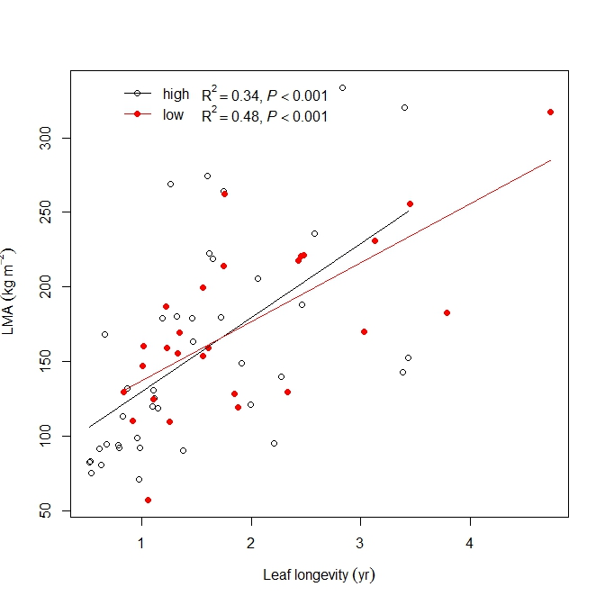

## figsci
Guofang Liu

This is a R package used to plotting a scatter plot, one-way or two-way barplot annonated by statistical parameter, visualizing phylogenetic barplot with its associated continuous variables, agenda plot, and randomized block experiment layout, search R packages based on developer's name, save R data.frame into excel format, search influential factors by means of regular expression, and ten segments boundary for Southern Sea China etc. 


```r
  #install.packages("devtools")
  devtools::install_github("liuguofang/figsci")
  library(figsci)
```

If it doesn't work, you downloaded the zip file (you will see the green button "clone or download." on top right place), unzipped it and the following worked.

```r
devtools::install("C:\\Users\\liuguofang\\Desktop\\figsci-master") # please replace your own file path. 
```

The `scatterplot.r2p` function can make a scatterplot with R<sup>2</sup> and p value for ordinary linear regressions.
```r
data(leaflife,package='smatr')
scatterplot.r2p(dat=leaflife,x='longev',y='lma',group='soilp',pty=c(1,19),xlab=Leaf~longevity~(yr),ylab=~LMA~(kg~m^-2))
```

 


`sci.search` could carrry out searching journal(s) based regular expression.

```r
sci.search(journal=c('^ecology$','^journal of ecology','Functional ec(.*?)gy','journal of applied ecology',
'^sustainability$','plos one','scientific reports'),yr=2018)
```

```r
      Rank         Full.Journal.Title JCR.Abbreviated.Title      ISSN Total.Cites   IF2   IF5 Eigenfactor.Score year Soil Ecology Plant      Bio.Conservatation Environment
22530 1019                    ECOLOGY               ECOLOGY 0012-9658      60,825 4.617 5.677           0.04415 2018      ecology                                          
44421  807         JOURNAL OF ECOLOGY                J ECOL 0022-0477      18,409 5.172 6.525           0.02482 2018      ecology plant                                    
28813  719         FUNCTIONAL ECOLOGY            FUNCT ECOL 0269-8463      14,638 5.491 5.657           0.02176 2018      ecology                                          
41305  658 JOURNAL OF APPLIED ECOLOGY           J APPL ECOL 0021-8901      18,142 5.742 6.160           0.02282 2018      ecology                                          
77792 4599             Sustainability  SUSTAINABILITY-BASEL 2071-1050       8,904 2.075 2.177           0.01377 2018                                            environment
67415 2975                   PLoS One              PLOS ONE 1932-6203     582,877 2.766 3.352           1.86235 2018                    Biological Conservation            
74403 1308         Scientific Reports            SCI REP-UK 2045-2322     192,841 4.122 4.609           0.71896 2018                    
```
