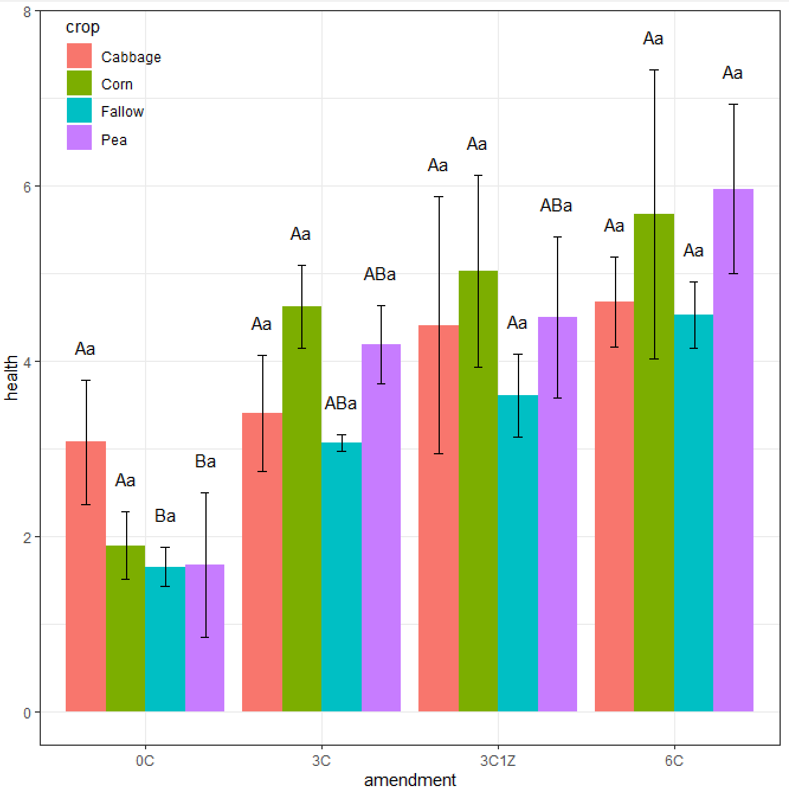
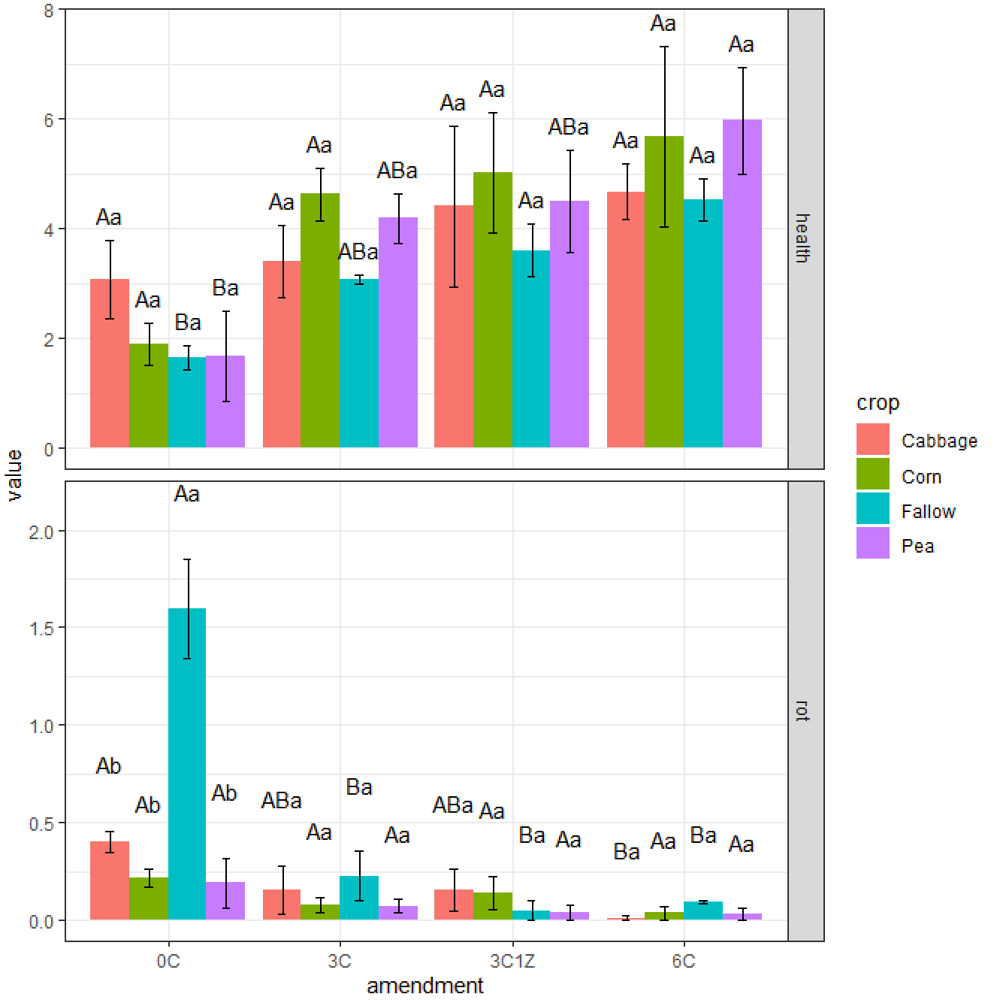

## figsci
Guofang Liu

The figsci package is a R package used to plot a scatterplot, one-way or two-way barplot annonated by statistical parameter, visualizing phylogenetic barplot with its associated continuous variables, make agenda plot, and randomized block experiment layout, search R packages based on developer's name, save R data.frame into excel format, search influential factors by means of regular expression, and ten segments boundary for Southern Sea China, transform PDF into png with given DPI, etc. 

 


```r
  #install.packages("devtools")
  devtools::install_github("liuguofang/figsci")
  library(figsci)
```

If it doesn't work, you downloaded the zip file (you will see the green button "clone or download." on top right place), unzipped it and the following worked.

```r
devtools::install("C:\\Users\\liuguofang\\Desktop\\figsci-master") # please replace your own file path. 
```

The `twoway_barplot_facet` function can draw two-way bar plot(s) with or without facet function used in ggplot2 and add the uppercase and lowercase representing significant differene between groups or between x.factors.

```r
data(Chz2006,package='agricolae')
dat <- Chz2006$yield
p1 <- twoway_barplot_facet(data=dat,x.factor='amendment',group='crop',value='health')
p1 + theme(legend.position = c(0.1, 0.9), legend.background = element_blank())
```


```r
library(reshape)
dat2 <- melt(dat,id.vars=c("amendment", "crop", "block"))
multi.p <- twoway_barplot_facet(data=dat2,x.factor='amendment',group='crop',value='value',
    facet_row='variable',scale='free_y')
multi.p
```
 


